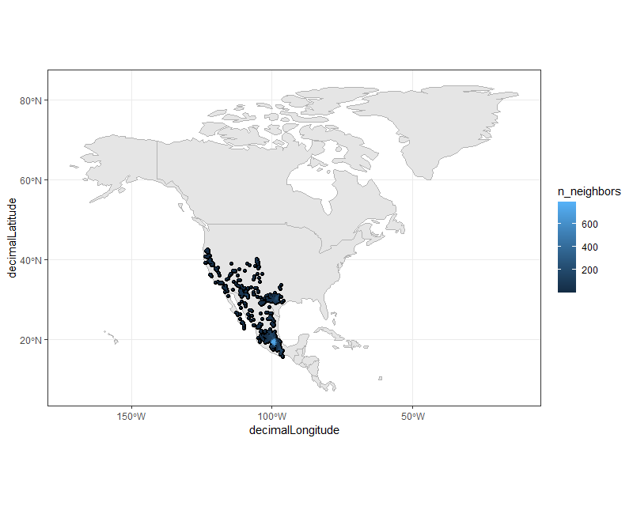

# Ringtail (cacomixtle) distribution
An example of mining, cleaning and visualization of species distribution data

- Used the library [rgbif](https://github.com/ropensci/rgbif) for getting GBIF data into R. I downloaded the distribution data of *Bassariscus astutus*, a cute nocturnal mammal common throughout Central Mexico, the Californias and the US southwest. In Mexico it is known as Cacomixtle and has recently started being spotted more often in urban areas for unknown (to me) reasons.

- Data cleaning courtesy of dplyr and [Coordinate cleaner](https://github.com/ropensci/CoordinateCleaner)

- I got the Shapefiles for Mexico City Geographical Data from [INEGI](https://www.inegi.org.mx/temas/mg/#Descargas), the mexican Institute for Statistics and Geography
## Maps
The distribution density of Cacomixtles in North America after coordinate cleaning:

### CDMX
Distribution of Cacomixtles in CDMX and surroundings:

The same distribution showing the rivers and canals in CDMX in blue. Most observations are in and around the huge university campus and in the city west, where vegetation and green spaces are much more abundant.

#### To do:
With more time and a good GPU it would be fun to do these maps in 3D using rayshader to visualize orography and/or population density 
